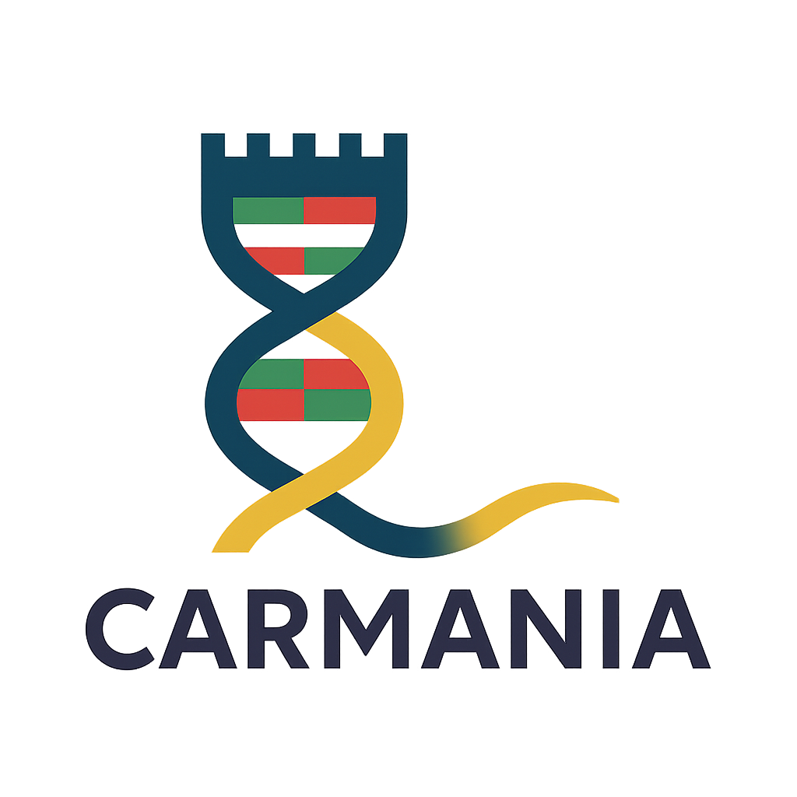

<p align="center">
  
</p>

# CARMANIA

**Context-Aware Regularization with Markovian Integration for Attention-Based Nucleotide Analysis**

> 🚧 This repository is under active development and will be updated very soon with full training code, evaluation scripts, and usage examples. Stay tuned!

CARMANIA is a self-supervised genomic language model framework that augments next-token prediction with a transition-matrix regularization loss. This integration improves biological sequence modeling by aligning predicted transitions with empirical k-mer statistics, allowing for better long-range dependency modeling and functional interpretation.

---

## 🧠 Pretrained Models

The following models are already available for use on [Hugging Face Hub](https://huggingface.co/MsAlEhR):

- 🔬 [`MsAlEhR/carmania-big-10k-prok-genome`](https://huggingface.co/MsAlEhR/carmania-big-10k-prok-genome)  
- 🧬 [`MsAlEhR/carmania-4k-scp-gene-taxa`](https://huggingface.co/MsAlEhR/carmania-4k-scp-gene-taxa)  
- 🧠 [`MsAlEhR/carmania-160k-seqlen-human`](https://huggingface.co/MsAlEhR/carmania-160k-seqlen-human)

---

## 🚀 Quick Start

```python
from transformers import AutoModel, AutoTokenizer

model = AutoModel.from_pretrained("MsAlEhR/carmania-160k-seqlen-human", trust_remote_code=True)
tokenizer = AutoTokenizer.from_pretrained("MsAlEhR/carmania-160k-seqlen-human", trust_remote_code=True)

inputs = tokenizer("ACGTAGGCTA...", return_tensors="pt")
outputs = model(**inputs)
